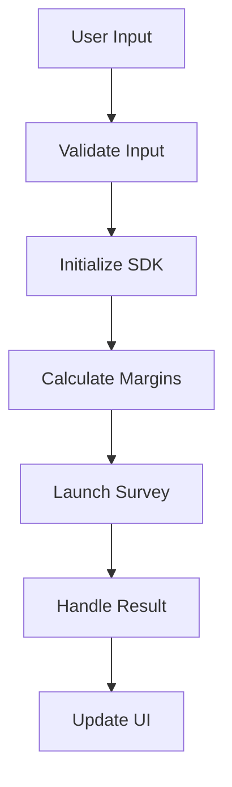
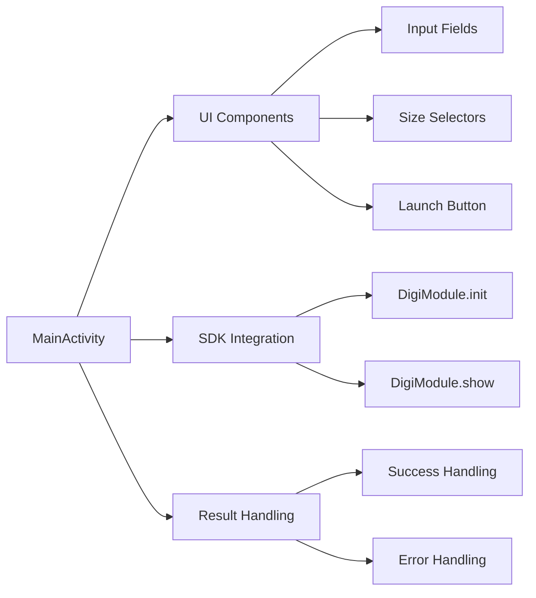
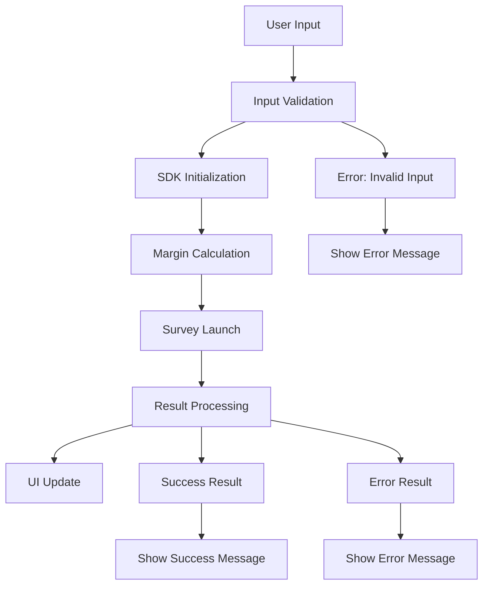

# Architecture Overview

## Overview

This document provides a comprehensive overview of the demo app's architecture, key components, and how they work together to provide a complete SDK integration example.

## 🏗️ App Structure

### Directory Structure

```
digi-android-demo/
├── app/
│   ├── src/main/
│   │   ├── java/com/sandsiv/surveytest/
│   │   │   ├── MainActivity.kt              # Main activity with survey logic
│   │   │   └── SurveyTestApplication.kt     # Application class
│   │   ├── res/
│   │   │   ├── layout/
│   │   │   │   └── activity_main.xml        # Main UI layout
│   │   │   ├── drawable/                    # Icons and selectors
│   │   │   │   ├── ic_survey_*.xml          # Size selector icons
│   │   │   │   └── selector_*.xml           # Selection state drawables
│   │   │   ├── values/
│   │   │   │   ├── colors.xml               # Color definitions
│   │   │   │   ├── strings.xml               # String resources
│   │   │   │   └── themes.xml               # Theme definitions
│   │   │   └── AndroidManifest.xml          # App configuration
│   │   └── build.gradle                     # App-level build configuration
│   └── build.gradle                         # Project-level build configuration
├── settings.gradle                           # Repository configuration
└── docs/                                     # Documentation
```

## 🎯 Core Components

### MainActivity.kt

**Purpose**: Central component handling all survey-related functionality

**Key Responsibilities**:
- UI initialization and event handling
- Survey configuration and validation
- SDK integration and survey launching
- Result handling and user feedback
- Dynamic margin calculation

**Key Methods**:
```kotlin
class MainActivity : AppCompatActivity() {
    // UI Components
    private lateinit var apiUrlInput: TextInputEditText
    private lateinit var surveyIdInput: TextInputEditText
    private lateinit var languageInput: TextInputEditText
    private lateinit var launchButton: MaterialButton
    private lateinit var sizeRadioGroup: RadioGroup
    
    // Core Methods
    private fun initializeViews()           // Bind UI components
    private fun setupClickListeners()      // Configure event handlers
    private fun launchSurvey()             // Main survey launch logic
    private fun calculateMargins()          // Dynamic margin calculation
    private fun handleSurveyResult()       // Result processing
}
```

### SurveyTestApplication.kt

**Purpose**: Application-level initialization and configuration

**Key Responsibilities**:
- Global app configuration
- SDK initialization (optional)
- Application lifecycle management

**Implementation**:
```kotlin
class SurveyTestApplication : Application() {
    override fun onCreate() {
        super.onCreate()
        // SDK will be initialized when user launches a survey
        // Alternative: Initialize globally here
    }
}
```

## 🎨 UI Architecture

### Layout Structure

```
ScrollView (Root)
└── ConstraintLayout
    ├── TextView (Header)
    ├── MaterialCardView (Configuration)
    │   └── LinearLayout
    │       ├── TextInputLayout (API URL)
    │       ├── LinearLayout (Survey ID + Language)
    │       └── RadioGroup (Size Selectors)
    ├── MaterialButton (Launch)
    └── TextView (Status)
```

### Size Selector System

**Components**:
- **RadioGroup**: Container for size selection
- **RadioButton**: Individual size options with custom styling
- **Icons**: Visual representation of survey sizes
- **Selectors**: State-based icon switching

**Icon Types**:
- `ic_survey_full_screen.xml` - Full screen representation
- `ic_survey_middle_third.xml` - Middle third representation
- `ic_survey_bottom_third.xml` - Bottom third representation
- `*_selected.xml` - Selected state variants
- `selector_*.xml` - State-based icon switching

## 🔧 SDK Integration Architecture

### SDK Initialization Flow



### Key Integration Points

1. **SDK Initialization**
   ```kotlin
   DigiModule.init(
       url = apiUrl,
       context = this
   )
   ```

2. **Survey Launching**
   ```kotlin
   DigiModule.show(
       surveyId = surveyId,
       language = language,
       context = this,
       margins = margins,
       cornerRadius = 16,
       onResult = { result -> ... }
   )
   ```

3. **Result Handling**
   ```kotlin
   when (result) {
       is Result.Success -> { /* Handle success */ }
       is Result.Error -> { /* Handle error */ }
   }
   ```

## 📱 Data Flow Architecture

### Input Processing

```
User Input → Validation → Configuration → SDK Call → Result Processing → UI Update
```

### Margin Calculation Flow

```
Screen Metrics → Size Selection → Margin Calculation → Margins Object → SDK
```

**Detailed Flow**:
1. Get screen dimensions in pixels
2. Convert to DP using density
3. Apply size-specific calculations
4. Create Margins object
5. Pass to SDK

### Result Processing Flow

```
SDK Result → Type Checking → Error Handling → User Feedback → UI Update
```

## 🎯 Component Interactions

### MainActivity Component Diagram



### Data Flow Diagram



## 🔍 Debug Architecture

### Logging System

**Components**:
- **Console Logging**: WebView JavaScript console capture
- **Dimension Logging**: Screen size and margin calculations
- **Network Logging**: HTTP request/response tracking
- **State Logging**: SDK initialization and survey lifecycle

**Implementation**:
```kotlin
// WebView debugging
WebView.setWebContentsDebuggingEnabled(true)

// Console message handling
webView.webChromeClient = object : WebChromeClient() {
    override fun onConsoleMessage(consoleMessage: ConsoleMessage): Boolean {
        Log.d("WebView", "Console: ${consoleMessage.message()}")
        return true
    }
}
```

### Error Handling Architecture

**Error Types**:
- **Input Validation Errors**: Missing or invalid input
- **Network Errors**: Connection or script loading issues
- **SDK Errors**: Survey launch or execution failures
- **Result Errors**: Survey completion or data processing issues

**Error Flow**:
```
Error Detection → Error Classification → Error Handling → User Feedback
```

## 🎨 UI Architecture Patterns

### Material Design Integration

**Components**:
- **MaterialCardView**: Configuration container
- **TextInputLayout**: Input fields with validation
- **MaterialButton**: Primary action button
- **RadioGroup**: Size selection

**Styling**:
- Consistent color scheme
- Proper elevation and shadows
- Responsive design patterns
- Accessibility support

### Responsive Design

**Screen Size Adaptation**:
- **Large Screens**: Generous margins and spacing
- **Medium Screens**: Standard margins and spacing
- **Small Screens**: Compact margins and spacing

**Orientation Handling**:
- Dynamic margin recalculation
- Layout adaptation
- State preservation

## 🔧 Build Architecture

### Gradle Configuration

**Project Structure**:
```
build.gradle (Project) → settings.gradle → app/build.gradle
```

**Dependency Management**:
- SDK dependency from Google Artifact Registry
- OkHttp dependencies for network functionality
- AndroidX libraries for UI components
- Kotlin version compatibility

### Build Configuration

**Key Settings**:
- **Compile SDK**: 34 (Android 14)
- **Min SDK**: 21 (Android 5.0)
- **Target SDK**: 34 (Android 14)
- **Kotlin Version**: 1.9.10

## 📱 Lifecycle Architecture

### Activity Lifecycle

```
onCreate() → initializeViews() → setupClickListeners() → launchSurvey() → handleResult()
```

**Key Lifecycle Methods**:
- `onCreate()`: Initial setup and UI binding
- `onDestroy()`: Cleanup and resource management
- `onConfigurationChanged()`: Orientation and screen size changes

### SDK Lifecycle

```
SDK Init → Survey Launch → Survey Display → Result Processing → Cleanup
```

## 🎯 Integration Patterns

### Configuration Pattern

**Input Validation**:
```kotlin
private fun validateInput(): Boolean {
    val apiUrl = apiUrlInput.text.toString().trim()
    val surveyIdText = surveyIdInput.text.toString().trim()
    val language = languageInput.text.toString().trim()
    
    return apiUrl.isNotEmpty() && surveyIdText.isNotEmpty() && language.isNotEmpty()
}
```

**Dynamic Configuration**:
```kotlin
private fun createSurveyConfig(): SurveyConfig {
    return SurveyConfig(
        apiUrl = apiUrlInput.text.toString().trim(),
        surveyId = surveyIdInput.text.toString().trim().toInt(),
        language = languageInput.text.toString().trim(),
        size = getSelectedSize(),
        margins = calculateMargins()
    )
}
```

### Result Handling Pattern

**Success Handling**:
```kotlin
private fun handleSuccess(result: Result.Success) {
    showToast("Survey completed successfully!")
    updateStatus("Survey completed")
    // Additional success logic
}
```

**Error Handling**:
```kotlin
private fun handleError(result: Result.Error) {
    val errorMessage = when (result.status) {
        401 -> "Authentication failed"
        404 -> "Survey not found"
        else -> "Survey failed: ${result.message}"
    }
    showError(errorMessage)
    updateStatus("Survey failed")
}
```

## 🔍 Testing Architecture

### Test Categories

**Unit Tests**:
- Input validation logic
- Margin calculation logic
- Result handling logic

**Integration Tests**:
- SDK initialization
- Survey launching
- Result processing

**UI Tests**:
- User interaction flows
- Size selector functionality
- Error handling scenarios

### Test Structure

```
test/
├── java/com/sandsiv/surveytest/
│   ├── MainActivityTest.kt
│   ├── MarginCalculationTest.kt
│   └── ResultHandlingTest.kt
└── androidTest/
    └── java/com/sandsiv/surveytest/
        └── MainActivityUITest.kt
```

## 📋 Architecture Checklist

### Core Components
- [ ] MainActivity with complete functionality
- [ ] Application class for global configuration
- [ ] UI layout with proper structure
- [ ] Size selector system with icons
- [ ] Result handling implementation

### Integration Points
- [ ] SDK initialization logic
- [ ] Survey launching implementation
- [ ] Margin calculation system
- [ ] Error handling framework
- [ ] User feedback system

### Quality Assurance
- [ ] Input validation
- [ ] Error handling
- [ ] User feedback
- [ ] Debug logging
- [ ] Performance optimization

## 🚨 Common Architectural Issues

### Issue: Tight Coupling
**Solution**: Use dependency injection and interface-based design

### Issue: Poor Error Handling
**Solution**: Implement comprehensive error handling with user feedback

### Issue: Hard-coded Values
**Solution**: Use configuration classes and dynamic parameter handling

### Issue: Poor Separation of Concerns
**Solution**: Separate UI logic, business logic, and data handling

## 📖 Next Steps

- Review [Code Examples](code-examples.md) for implementation details
- Check [Best Practices](best-practices.md) for production recommendations
- Explore [Troubleshooting Guide](troubleshooting.md) for common issues
- Read [API Reference](api-reference.md) for detailed method documentation

---

*This architecture overview provides a comprehensive understanding of the demo app's structure and design patterns. Use it as a reference for implementing your own SDK integration.*

